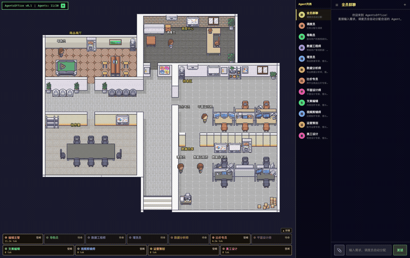

<p align="center">
  <a href="README_zh-CN.md">简体中文</a> ·
  <a href="README_zh-TW.md">繁體中文</a> ·
  <a href="README.md">English</a> ·
  <a href="README_ja.md">日本語</a>
</p>

<p align="center">
  
</p>

<h1 align="center">AgentFleet</h1>

<p align="center">
  <strong>AI チームに目に見えるオフィスを</strong><br/>
  <sub>ドット絵 RPG マルチ Agent 協調ワークスペース</sub>
</p>

<p align="center">
  <a href="https://github.com/DBell-workshop/AgentFleet/stargazers"></a>
  <a href="https://github.com/DBell-workshop/AgentFleet/blob/main/LICENSE"></a>
  <a href="#"></a>
  <a href="#"></a>
  <a href="https://github.com/DBell-workshop/AgentFleet/releases/latest"></a>
</p>

<p align="center">
  <a href="#screenshots">スクリーンショット</a> ·
  <a href="#features">機能</a> ·
  <a href="#quick-start">クイックスタート</a> ·
  <a href="#pro-vs-lite">Pro vs Lite</a> ·
  <a href="#support">応援する</a>
</p>

---

## AgentFleet とは？

AgentFleet は**マルチ Agent 協調ワークベンチ**です。ドット絵風 RPG オフィスの中で、あなたの AI チームが「目に見える形で働く」姿を実現します。

役割を定義し、プロンプトを書き、シーンを選ぶだけ —— 数分であなた専用の AI ワークフォースが完成します。

> **他の「ドット絵オフィス」プロジェクトとは違います：私たちの Agent はただ歩き回るだけではなく、本当に仕事をします。**

| 他のプロジェクト | AgentFleet |
|---------|-------------|
| Agent の状態を表示するだけのダッシュボード | **本格的な AI ワークベンチ** — Agent が実際に協調して動く |
| 外部 AI ツールが必要 | **LLM チャット + 委任エンジン内蔵**、すぐに使える |
| 単一ロールのデモ | **マルチロールチーム協調** — ディスパッチャーが自動でタスクを割り振り |
| 閲覧のみ | **チャット、タスク委任、リアルタイム進捗追跡** |

---

<a id="screenshots"></a>
## スクリーンショット

> スクリーンショットは **AgentFleet Pro** のものです。Lite（オープンソース版）にはコアのドット絵オフィス、Agent チャット、シーンシステムが含まれます。

<table>
<tr>
<td width="50%"><br/><sub>6つのプリセットシーン：EC運営、メディアスタジオ、カスタマーサービス、開発チーム、ゲームスタジオ、クオンツトレーディング</sub></td>
<td width="50%"><br/><sub>リアルタイムオペレーションダッシュボード：トークン使用量、コスト追跡、Agent アクティビティ</sub></td>
</tr>
<tr>
<td><br/><sub>ライトテーマダッシュボード：委任ファネル、モデル使用状況</sub></td>
<td><br/><sub>ガイド付きオンボーディング：シーンを選んですぐに作業開始</sub></td>
</tr>
</table>

---

<a id="features"></a>
## 機能

### 🏢 ドット絵 RPG オフィス
Phaser 3 ゲームエンジン上に構築 —— 2D ドット絵オフィスで、各 Agent が専用のデスク、部屋、アニメーションを持ちます。

### 🎭 シーンシステム
プリセットシーンテンプレートを切り替えてチーム全体を再構成：
- **メディアスタジオ** —— コピーライター、動画編集、運営企画、デザイナー
- **EC 運営センター** —— データエンジニア、データ PM、運営企画
- **カスタマーサービス** —— 受付、クレーム対応、フォローアップ
- **開発チーム、ゲームスタジオ、クオンツトレーディング**など

各シーンは独立した Agent チーム、チャット履歴、委任記録を持ちます —— 完全に分離されています。

### 🤖 柔軟な Agent システム
- **無制限の Agent**：必要な役割を自由に作成
- **Agent ごとのモデル設定**：Gemini、Claude、GPT、DeepSeek、Qwen から選択
- **20 種類のドット絵キャラクター**
- **デスクトップペット猫** —— Agent の活動に反応（12 品種！）

### 💬 スマートな会話
- **グループチャット**：ディスパッチャーが意図を自動検出し適切な Agent に割り振り
- **ダイレクトメッセージ**：特定の Agent と 1 対 1 で深い会話
- **ラウンドテーブル**：複数の Agent が複雑なトピックについて協議

### 📋 委任システム（Pro）
一言で要件を伝えるだけ —— AI チームが自動で計画・実行します。

### 📊 オペレーションダッシュボード（Pro）
リアルタイム監視：トークン使用量、コスト追跡、Agent アクティビティ、委任ファネル。

### 🐱 デスクトップペット
ドット絵の猫パートナー —— 12 品種、ダブルクリックで切替。Agent が働くとタイピングアニメーション、タスク完了でお祝いエフェクト。

---

<a id="quick-start"></a>
## クイックスタート

### デスクトップアプリ（推奨）

[Releases](https://github.com/DBell-workshop/AgentFleet/releases/latest) から最新の DMG をダウンロード：

1. `AgentFleet_x.x.x_aarch64.dmg` をダウンロード（macOS Apple Silicon）
2. Applications にドラッグ
3. 起動 —— バックエンド起動中はドット絵のローディング画面が表示されます
4. 設定で API Key を入力してチャット開始

> DMG は Apple の署名・公証済み —— セキュリティ警告なしでインストールできます。

### 開発モード

```bash
git clone https://github.com/DBell-workshop/AgentFleet.git
cd AgentFleet

# バックエンド
python3 -m venv .venv && source .venv/bin/activate
pip install -r requirements.txt
python run_server.py

# フロントエンド（別ターミナル）
cd frontend && npm install && npm run dev
```

**http://localhost:8000/static/office/** にアクセス

### Docker

```bash
cp .env.example .env   # LLM API Key を最低1つ追加
docker compose up -d
```

---

<a id="pro-vs-lite"></a>
## Pro vs Lite

| 機能 | Lite（オープンソース） | Pro |
|------|:------------------:|:---:|
| ドット絵 RPG オフィス | ✅ | ✅ |
| Agent チャット（グループ + DM） | ✅ | ✅ |
| シーンテンプレート | ✅ | ✅ |
| Agent 設定パネル | ✅ | ✅ |
| ラウンドテーブル | ✅ | ✅ |
| デスクトップペット猫 | ✅ | ✅ |
| 委任システム | - | ✅ |
| オペレーションダッシュボード | - | ✅ |
| CLI 統合（Claude/Codex） | - | ✅ |
| デスクトップアプリ（Tauri） | - | ✅ |
| EC レポート Pack | - | ✅ |

> このリポジトリは **Lite** 版です。スクリーンショットの Pro 機能はデモ目的で表示しています。
>
> Pro に興味がありますか？[linkos.cc](https://linkos.cc) またはコミュニティに参加してください。

---

---

## ロードマップ

- [x] ドット絵 RPG オフィス + Agent アニメーション
- [x] シーンシステム + 分離された Agent とチャット履歴
- [x] グループチャット + DM + ラウンドテーブル
- [x] デスクトップペット猫（12 品種）
- [x] LLM コスト追跡
- [x] 委任システム / ダッシュボード / macOS デスクトップアプリ（Pro）
- [ ] Windows / Linux デスクトップアプリ
- [ ] モバイル対応レイアウト
- [ ] シーンテンプレート追加

---

<a id="support"></a>
## このプロジェクトを応援する

**⭐ [Star をつける](https://github.com/DBell-workshop/AgentFleet)** —— 最もシンプルな応援方法

---

## コミュニティ

<p align="center">
  <a href="https://discord.gg/3Cpe5H6m"></a>
</p>

---

## コントリビューション

- [Issue](https://github.com/DBell-workshop/AgentFleet/issues) でバグ報告や機能提案
- PR でコード貢献
- [Discussions](https://github.com/DBell-workshop/AgentFleet/discussions) でアイデア交換

---

## ライセンス

[Business Source License 1.1](LICENSE) · ✅ 個人/学習/研究 · ❌ 商用利用は許可が必要 · 📅 2030 年に Apache 2.0 に移行

---

<p align="center">
  <sub>Built with ❤️ by the AgentFleet Team</sub>
</p>
